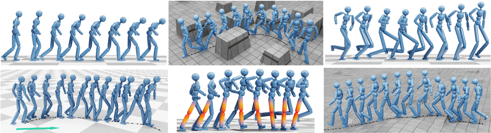
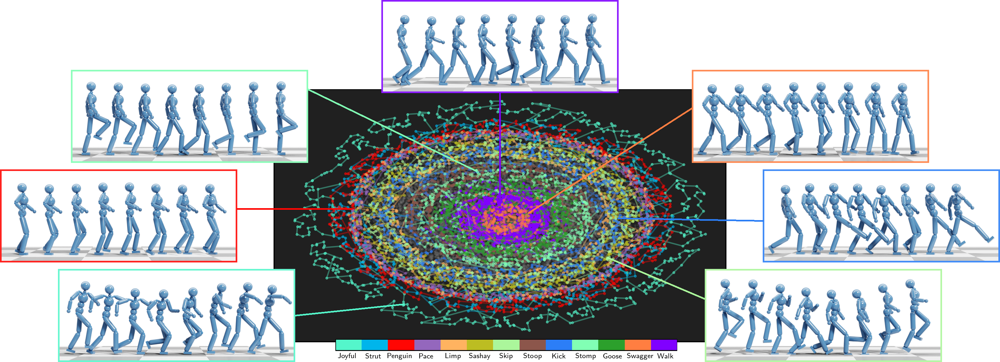

# AdaptNet: Policy Adaptation for Physics-Based Character Control

This is the official implementation for _*AdaptNet: Policy Adaptation for Physics-Based Character Control*_. 
[[arXiv](http://arxiv.org/abs/2310.00239)]
[[Youtube](https://youtu.be/WxmJSCNFb28)]
([SIGGRAPH Asia'23](https://asia.siggraph.org/2023/presentation/?id=papers_543&sess=sess120), [TOG](https://dl.acm.org/doi/10.1145/3618375))

This implementation is based on 
[[webpage](https://pei-xu.github.io/CompositeMotion)]
[[code](https://github.com/xupei0610/CompositeMotion)]

- _*Composite Motion Learning with Task Control*_
[[arXiv](https://arxiv.org/abs/2305.03286)]
[[Youtube](https://youtu.be/mcRAxwoTh3E)]
([SIGGRAPH'23](https://s2023.siggraph.org/presentation/?id=papers_763&sess=sess118), [TOG](https://dl.acm.org/doi/abs/10.1145/3592447))

- _*A GAN-Like Approach for Physics-Based Imitation Learning and Interactive Character Control*_
[[arXiv](https://arxiv.org/abs/2105.10066)]
[[Youtube](https://www.youtube.com/watch?v=VHMyvDD3B_o)]
([SCA'21](https://www.youtube.com/watch?v=vPzpCarkm74), [PACMCGIT](https://dl.acm.org/doi/abs/10.1145/3480148))

## Code Usage

### Dependencies
- Pytorch 1.12
- IsaacGym Pr4

We recommend to install all the requirements through Conda by

    $ conda create --name <env> --file requirements.txt -c pytorch -c conda-forge

Download IsaacGym Pr4 from the [official site](https://developer.nvidia.com/isaac-gym) and install it via pip.

### Policy Evaluation

    $ python main.py <configure_file> --meta <pretrained_meta_policy> --ckpt <checkpoint_dir> --test

We provide pretrained policy models in `pretrained` folder. To evaluate a pretrained policy, e.g. please run

    $ python main.py config/config_run_lowfriction.py \
      --meta pretrained/locomotion_run --ckpt pretrained/run_lowfriction \
      --test

    $ python main.py config/config_walk_lowfriction.py \
      --meta pretrained/locomotion_walk --ckpt pretrained/walk_lowfriction \
      --test

    $ python main.py config/config_terrain.py \
      --meta pretrained/locomotion_walk --ckpt pretrained/walk_terrain \
      --test

    $ python main.py config/config_walk_jaunty.py \
      --meta pretrained/locomotion_walk --ckpt pretrained/walk_jaunty \
      --test

    $ python main.py config/config_walk_stoop.py \
      --meta pretrained/locomotion_walk --ckpt pretrained/walk_stoop \
      --test
    
## Citation

If you use the code or provided motions for your work, please consider citing our papers:

    @article{adaptnet,
        author = {Xu, Pei and Xie, Kaixiang and Andrews, Sheldon and Kry, Paul G and Neff, Michael and McGuire, Morgan and Karamouzas, Ioannis and Zordan, Victor},
        title = {{AdaptNet}: Policy Adaptation for Physics-Based Character Control},
        journal = {ACM Transactions on Graphics},
        publisher = {ACM New York, NY, USA},
        year = {2023},
        volume = {42},
        number = {6},
        doi = {10.1145/3618375}
    }

    @article{composite,
        author = {Xu, Pei and Shang, Xiumin and Zordan, Victor and Karamouzas, Ioannis},
        title = {Composite Motion Learning with Task Control},
        journal = {ACM Transactions on Graphics},
        publisher = {ACM New York, NY, USA},
        year = {2023},
        volume = {42},
        number = {4},
        doi = {10.1145/3592447}
    }

    @article{iccgan,
        author = {Xu, Pei and Karamouzas, Ioannis},
        title = {A {GAN}-Like Approach for Physics-Based Imitation Learning and Interactive Character Control},
        journal = {Proceedings of the ACM on Computer Graphics and Interactive Techniques},
        publisher = {ACM New York, NY, USA},
        year = {2021},
        volume = {4},
        number = {3},
        pages = {1--22},
        doi = {10.1145/3480148}
    }
    
